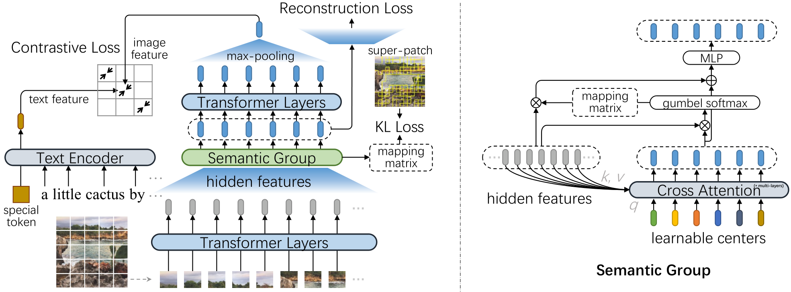

# SegCLIP: Patch Aggregation with Learnable Centers for Open-Vocabulary Semantic Segmentation

The implementation of paper [**SegCLIP: Patch Aggregation with Learnable Centers for Open-Vocabulary Semantic Segmentation**](https://arxiv.org/abs/2211.14813). 

> In this paper, we propose a CLIP-based model named SegCLIP for the topic of open-vocabulary segmentation in an annotation-free manner. The SegCLIP achieves segmentation based on ViT and the main idea is to gather patches with learnable centers to semantic regions through training on text-image pairs. The gathering operation can dynamically capture the semantic groups, which can be used to generate the final segmentation results. We further propose a reconstruction loss on masked patches and a superpixel-based KL loss with pseudo-labels to enhance the visual representation. Experimental results show that our model achieves comparable or superior segmentation accuracy on the PASCAL VOC 2012 (+0.3% mIoU), PASCAL Context (+2.3% mIoU), and COCO (+2.2% mIoU) compared with baselines.



## Requirements
```shell
conda create -n segclip python=3.8 -y
conda activate segclip
conda install pytorch==1.8.0 torchvision==0.9.0 cudatoolkit=11.1 -c pytorch -c conda-forge
pip install mmcv-full==1.3.14 -f https://download.openmmlab.com/mmcv/dist/cu111/torch1.8.0/index.html
pip install mmsegmentation==0.18.0
pip install webdataset==0.1.103
pip install timm==0.4.12
pip install opencv-python==4.4.0.46 termcolor==1.1.0 diffdist einops omegaconf
pip install nltk ftfy regex tqdm
pip install prefetch_generator
pip install Pillow==8.2.0
```

## Pretrain Weight
```shell
mkdir checkpoints
wget -P ./checkpoints https://github.com/ArrowLuo/SegCLIP/releases/download/checkpoint_v0/segclip.bin
```

## Demo
_**Note**: `vis_mae_decoder.*` is not used in inference, so ignore the part of the log._ 

```shell
# voc
python main_seg_vis.py --input demo/examples/voc.jpg --device cuda:0 --vis input input_pred_label \
--dataset voc --init_model checkpoints/segclip.bin

# context
python main_seg_vis.py --input demo/examples/context.jpg --device cuda:0 --vis input input_pred_label \
--dataset context --init_model checkpoints/segclip.bin

# coco
python main_seg_vis.py --input demo/examples/coco.jpg --device cuda:0 --vis input input_pred_label \
--dataset coco --init_model checkpoints/segclip.bin
```
The results can be found in `output/vis_imgs/input_pred_label` in default.

## Evaluation

Download the [Pascal VOC dataset](https://github.com/open-mmlab/mmsegmentation/blob/master/docs/en/dataset_prepare.md#pascal-voc), [Pascal Context dataset](https://github.com/open-mmlab/mmsegmentation/blob/master/docs/en/dataset_prepare.md#pascal-context), and [COCO dataset](https://github.com/open-mmlab/mmsegmentation/blob/master/docs/en/dataset_prepare.md#coco-stuff-164k). For the COCO conversion, using [convert_dataset/convert_coco_object.py](https://github.com/NVlabs/GroupViT/blob/main/convert_dataset/convert_coco_object.py) or [preprocess/convert_coco_object4val.py](preprocess/COCO/convert_coco_object4val.py) instead of [tools/convert_datasets/coco_stuff164k.py](https://github.com/open-mmlab/mmsegmentation/blob/master/tools/convert_datasets/coco_stuff164k.py).

To run the below script, the `data_root` in `seg_segmentation/configs/_base_/datasets/*.py` should be modified at first.
```shell
# voc
CUDA_VISIBLE_DEVICES=0,1,2,3 python -m torch.distributed.launch --nproc_per_node=4 \
main_seg_zeroshot.py --dataset voc --init_model checkpoints/segclip.bin 

# context
CUDA_VISIBLE_DEVICES=0,1,2,3 python -m torch.distributed.launch --nproc_per_node=4 \
main_seg_zeroshot.py --dataset context --init_model checkpoints/segclip.bin 

# coco
CUDA_VISIBLE_DEVICES=0,1,2,3 python -m torch.distributed.launch --nproc_per_node=4 \
main_seg_zeroshot.py --dataset coco --init_model checkpoints/segclip.bin 
```

## Pretrain

The data config can be found in [dataloaders/data_config.py](./dataloaders/data_config.py)

Note: before running the scripts of data preprocess, the corresponding data path should be modified. 

### COCO
Download [2014 train images](http://images.cocodataset.org/zips/train2014.zip) and [karpathy split](https://cs.stanford.edu/people/karpathy/deepimagesent/caption_datasets.zip)

```commandline
mkdir -p data/mscoco
wget http://images.cocodataset.org/zips/train2014.zip -P data/mscoco
unzip data/mscoco/train2014.zip -d data/mscoco/ && rm data/mscoco/train2014.zip

python preprocess/COCO/write_coco_images.py --input_root data/mscoco --output_root data/COCO --data_split train2014

# Generate coco_train2014_seg_scale224_sigma9.0_min_size224.lmdb
python preprocess/COCO/felzenszwalb_extraction_coco.py
```

### GCC3M
Download the image text pairs of GCC3M via `img2dataset`. More details are referred to [img2dataset CC3M tutorial](https://github.com/rom1504/img2dataset/blob/main/dataset_examples/cc3m.md).
```bash
wget https://storage.cloud.google.com/gcc-data/Train/GCC-training.tsv?_ga=2.191230122.-1896153081.1529438250

cp Train_GCC-training.tsv cc3m_train.tsv
sed -i '1s/^/caption\turl\n/' cc3m_train.tsv

img2dataset --url_list cc3m_train.tsv --input_format "tsv" \
--url_col "url" --caption_col "caption" --output_format webdataset \
--output_folder cc3m_train --processes_count 16 --thread_count 64 --image_size 224 \
--resize_mode keep_ratio --resize_only_if_bigger \
--enable_wandb False

# Note: Step 1.1 ~ 1.3 can be merged together, which can generate lmdb directly along with extracting images from tar files without generating the middle pickles.
# Step 1.1: Generate cc3m_train_desc.pkl
python preprocess/GCC3M/extraxt_images_from_tar.py
# Step 1.2
python preprocess/GCC3M/combine_pickle.py
# Step 1.3: Generate cc3m_train_lmdb_total and cc3m_train_lmdb_total_keys.pkl
python preprocess/GCC3M/generate_lmdb_from_pickles.py
# Step 2: Generate cc3m_train_lmdb_total_seg_scale224_sigma9.0_min_size224.lmdb
python preprocess/GCC3M/felzenszwalb_extraction_cc.py
```

### Runing
Download the CLIP weight,
```shell
wget -P ./modules https://openaipublic.azureedge.net/clip/models/5806e77cd80f8b59890b7e101eabd078d9fb84e6937f9e85e4ecb61988df416f/ViT-B-16.pt
```

then run the pretraining script,
```shell
CUDA_VISIBLE_DEVICES=0,1,2,3,4,5,6,7 python -m torch.distributed.launch --nproc_per_node=8 main_task_align.py \
--do_pretrain --num_thread_reader=10 --epochs=10 --batch_size=768 --n_display=50 \
--output_dir ckpts/ckpt_segclip --lr 4e-3 --max_words 32 \
--datatype cc,coco, --lower_lr 4e-6 --use_pin_memory --use_seglabel --use_vision_mae_recon
```


## Citation
If you think this code is helpful or instructive in your research, please cite:
```bibtex
@Article{Luo2022SegCLIP,
  author  = {Huaishao Luo and Junwei Bao and Youzheng Wu and Xiaodong He and Tianrui Li},
  title   = {{SegCLIP}: Patch Aggregation with Learnable Centers for Open-Vocabulary Semantic Segmentation},
  journal = {arXiv preprint arXiv:2211.14813},
  year    = {2022},
}
```

## Acknowledgments
Our code is based on [GroupViT](https://github.com/NVlabs/GroupViT), [CLIP](https://github.com/openai/CLIP), 
and [CLIP4Clip](https://github.com/ArrowLuo/CLIP4Clip). Thanks for their contributions to the community.
